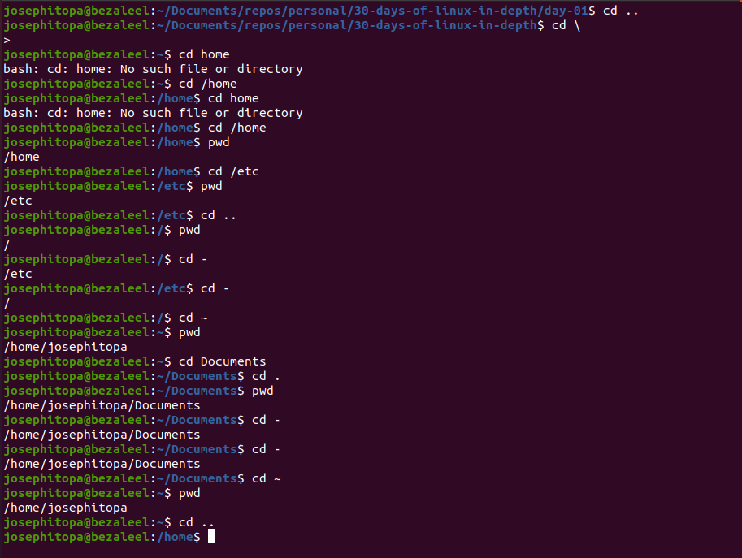

# Day 01 - [Absolute vs Relative Path in Linux]

---

## Objective

What was the goal for today?

- To learn absolute and relative path

---

## What I Learned

- When you type a path starting with a slash (/), then the root of the file tree is assumed. 
- If you don't start your path with a slash, then the current directory is the assumed starting point.
- In case your current directory is the root directory /, then both cd /home and cd home will get you in the /home directory.

---

## What I Built / Practiced

- I practised the following commands: pwd, cd;

---

## Challenges Faced

- None

---

## Key Takeaways
- 'cd' to change directory.
- 'cd -' to go to the previous directory.
- 'cd ..' to go to the parent directory.
- 'cd .' to remain in the current directory.
- 'pwd' to print working directory.

---

## Resources

- Linux Fundamentals by Paul Cobbaut.

---

## Output

(Include links, screenshots, code snippets, or results)
