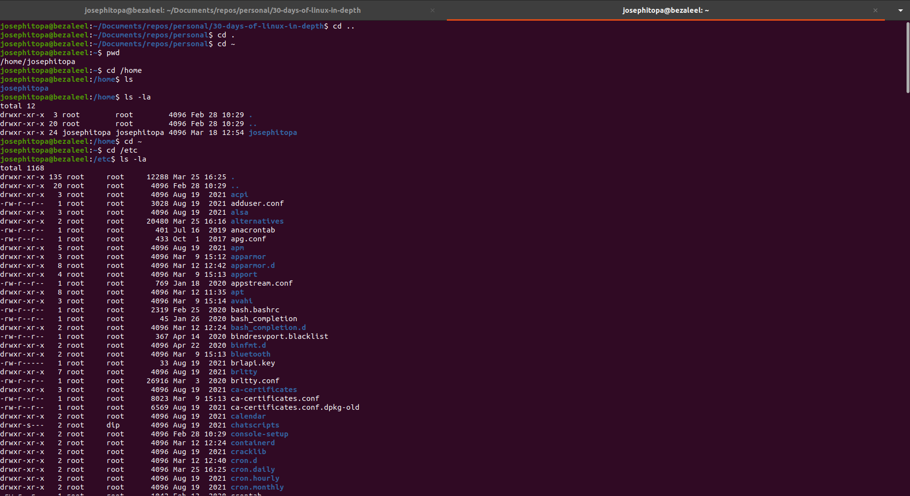
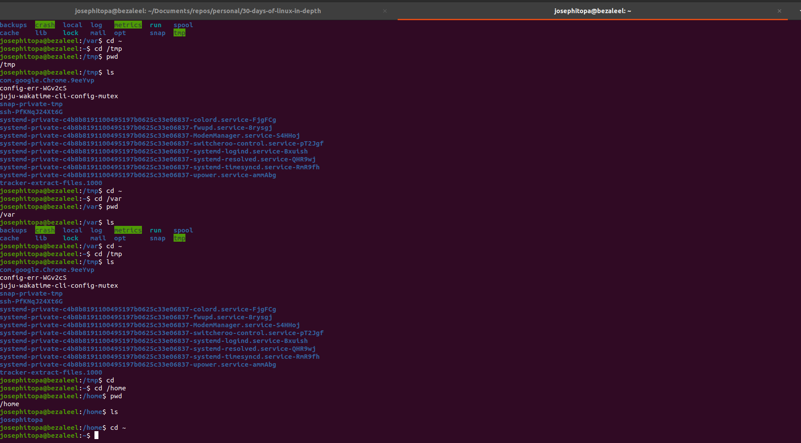

# Day 02 - [Exploring Directories in Linux]

## Objective

- To explore notable directories and list items in directories.

---

## What I Learned

- I learn to explore directories, print files and file sizes in directories.

---

## What I Built / Practiced

- I practised to navigate different directories.
- Listed files(including hidden files) while exploring the directories.
- Printed file size in each directories.

---

## Challenges Faced

- None

---

## Key Takeaways

- Explored by navigating to the following folders: home, etc, var, tmp.
- 'ls -la' list hidden files.
- 'ls -l -h' to show files and file sizes.

---

## Resources

- Linux Fundamentals by Paul Cobbaut.

---

## Output

(Include links, screenshots, code snippets, or results)

