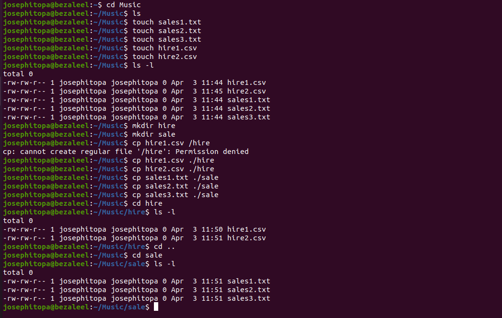

# Day 03 - [Working with files]

## Objective

- Create 10 files, and copy them into folders.

---

## What I Learned
- I learnt to create folders.
- I learnt to create files.
- I learnt to move files to folders.

---

## What I Built / Practiced
- I practiced creating files, folders, and copying files to folders.
- 

---

## Challenges Faced
- None

---

## Key Takeaways

- 'touch [file name]' - to create a file.
- 'mkdir [folder name]' - to create a folder.
- 'cp [file name] ./[folder name]' - to move files to specific folder.

---

## Resources

- Linux Fundamentals by Paul Cobbaut.

---

## Output

(Include links, screenshots, code snippets, or results)
