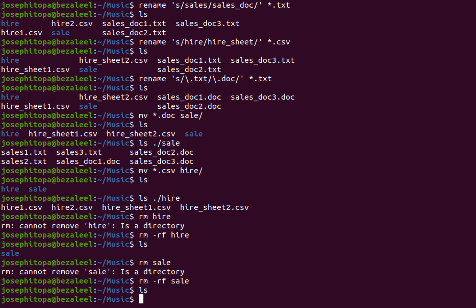
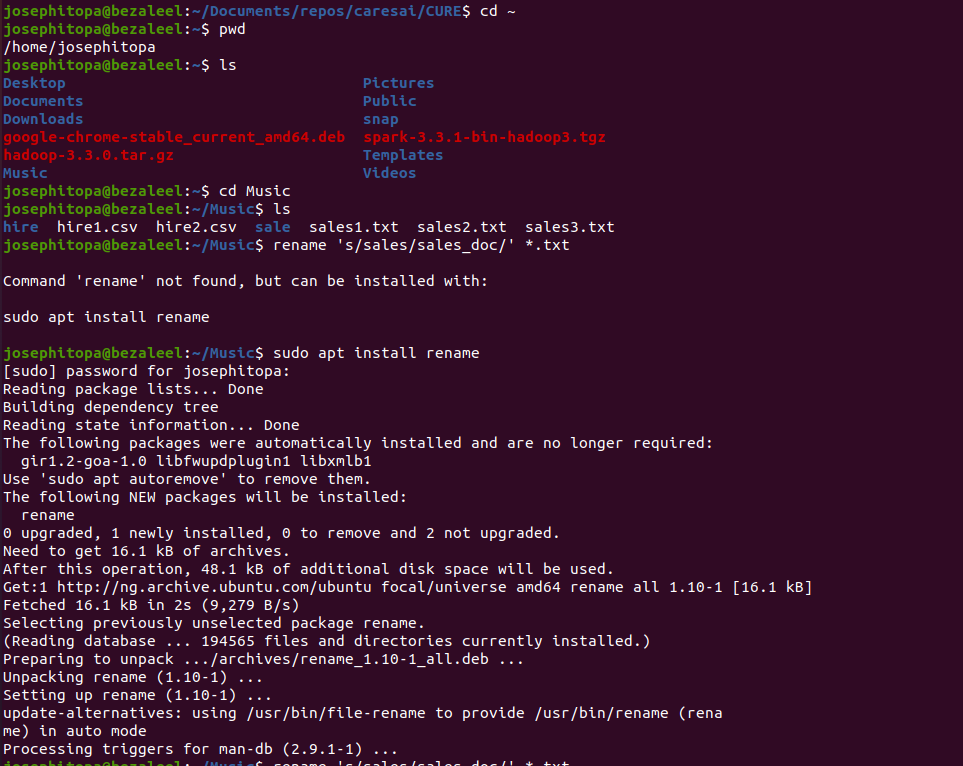

# Day 04 - [Working with files in-depth]

## Objective
- Rename, move, and delete files in bulk automatically.

---

## What I Learned

- To rename many files at once.
- To change extension of several files at once.
- To move files, and to permanently delete folders.

---

## What I Built / Practiced
- I practiced renaming files, and changing file extension.
- I practiced moving many files to a specific folder.
- I practised deleting the folders.

---

## Challenges Faced

- 'rename' does not natively exist in ubuntu. So I have to install it using 'sudo apt install rename'

---

## Key Takeaways
- "rename 's/.txt\/.doc\' *.doc" - to change file extension from '.txt' to '.doc'.
- "rename 's/hire/hire_sheet/' *.csv" - to change file name of multiple files with extension '.csv'.
- "rm -rf folder" - to permanently delete folders.
- "mv *.txt /folder" - to move files with specific extension into 'folder'. 

---

## Resources
- Linux Fundamentals by Paul Cobbaut.
- Google

---

## Output

(Include links, screenshots, code snippets, or results)

