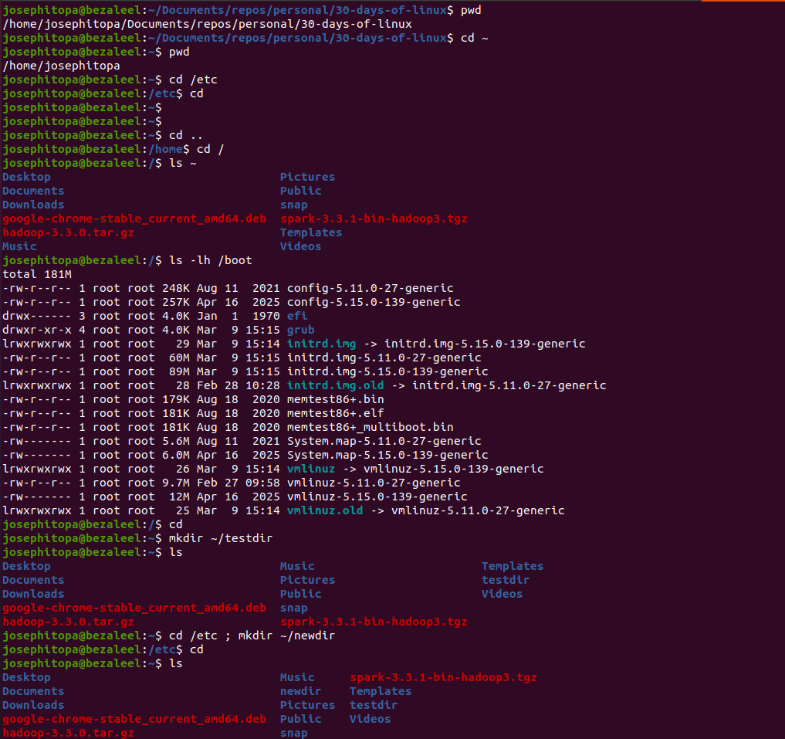
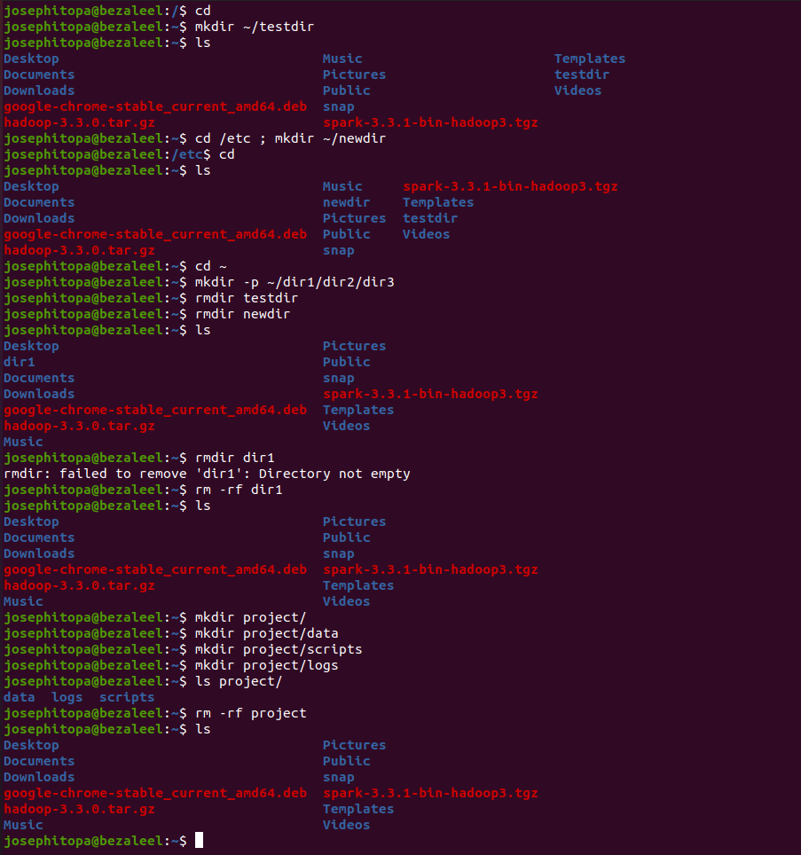

# Day 05 - [Working with directories]

## Objective
- To get familiar with directory operations, e.g. delete, create, remove, etc 

---

## What I Learned
- I learn to create a single directory, and a directory with sub-directory.
- I learn to delete directory and forcefully remove directory with sub-directory.
- I learn to work with multiple commands when dealing with directory.

---

## What I Built / Practiced
- I practiced creating and removing directories including sub-directories.
- I practiced to navigate and remain in a directory while creating a new directory.

---

## Challenges Faced
- None

---

## Key Takeaways
- 'mkdir [directory name]' - to create directory. 
- 'mkdir [directory name]/[sub-directory name]' - to create sub-directory.
- 'rmdir [directory name]' - to remove directory.
- 'rm -rf [directory name]' - to forcefully remove directory.

---

## Resources
- Linux Fundamentals by Paul Cobbaut.

---

## Output

(Include links, screenshots, code snippets, or results)

