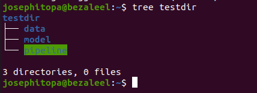
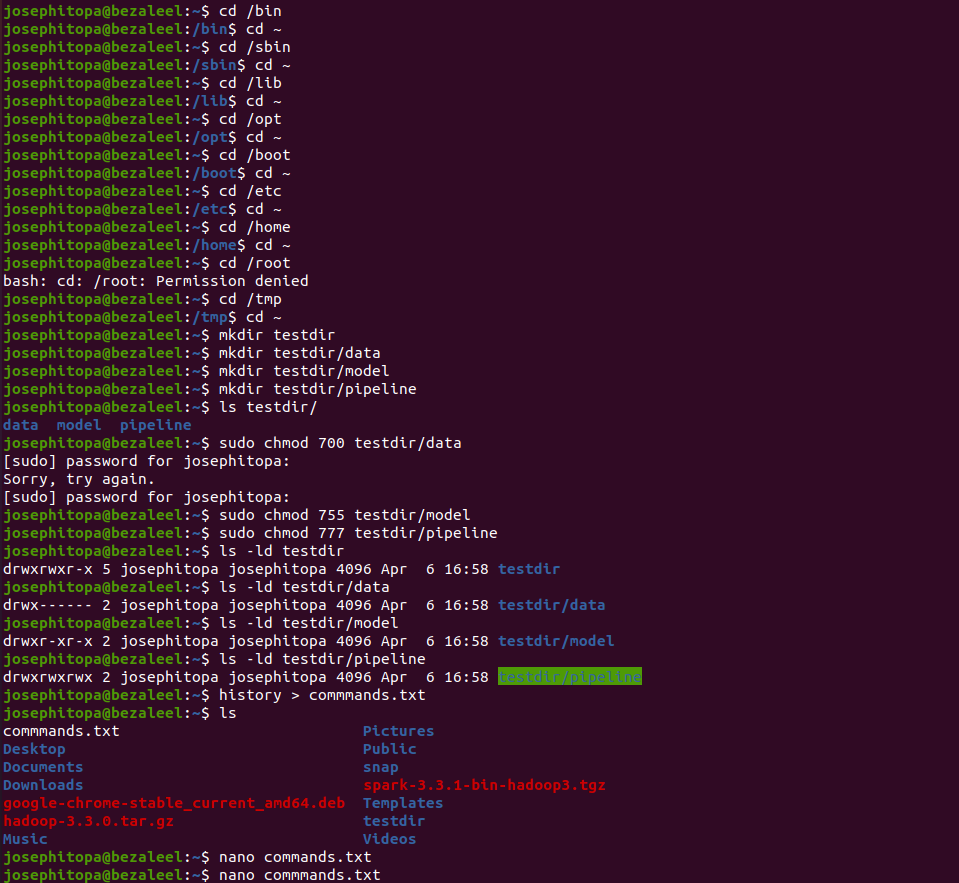

# Day 06 - [day-o6: working with directories and folder permissions]

## Objective
- The goal is to get familiar with system folders and associate specific permission to a folder.

---

## What I Learned
- I learnt about binary folder, system folder, temporary folder, 
- I learnt about assigning different permission to folders.
- I learnt about recording commands, and saving to text file. also saving historical command to text file.

---

## What I Built / Practiced
- I explored several system folders: /etc, /bin. /sbin, /tmp, /lib, /opt
- I practised assigning different permission to different directories.
- I practised using 'tree' to view directory structure.

---

## Challenges Faced
- assigning different permission to different directories.

---

## Key Takeaways
- 'chmod' - for assigning permission to folders (755, 777).
- 'chmod 755' - allowing the owner to read, write, and execute, the group to read and execute, and others to read and execute.
- 'chmod 700' - allowing the owner to read, write, and execute, and denying all permissions to the group and others.
- 'chmod 777' - Grant full access to everyone.
- 'tree' - view folder structure.

---

## Resources
- Linux Fundamentals by Paul Cobbaut.
- https://www.digitalocean.com/community/tutorials/how-to-set-permissions-linux

---

## Output
(Include links, screenshots, code snippets, or results)

  - cd /bin
  - cd ~
  - cd /sbin
  - cd ~
  - cd /lib
  - cd ~
  - cd /opt
  - cd ~
  - cd /boot
  - cd ~
  - cd /etc
  - cd ~
  - cd /home
  - cd ~
  - cd /root
  - cd /tmp
  - cd ~
  - mkdir testdir
  - mkdir testdir/data
  - mkdir testdir/model
  - mkdir testdir/pipeline
  - ls testdir/
  - sudo chmod 700 testdir/data
  - sudo chmod 755 testdir/model
  - sudo chmod 777 testdir/pipeline
  - ls -ld testdir
  - ls -ld testdir/data
  - ls -ld testdir/model
  - ls -ld testdir/pipeline
  - history > commmands.txt