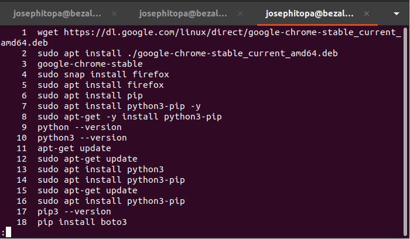
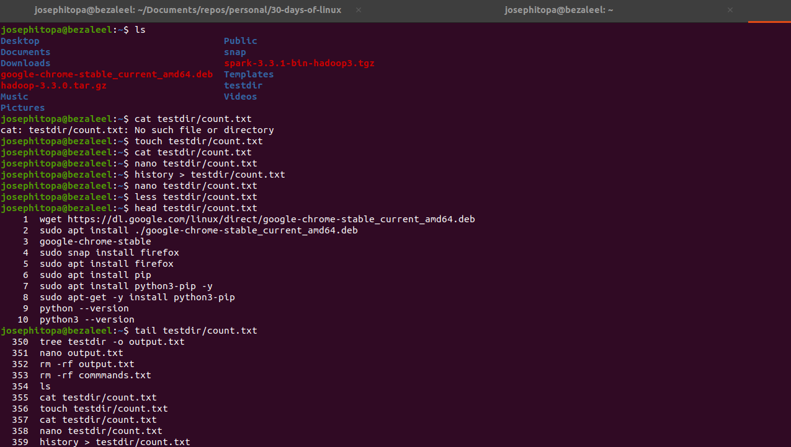

# Day 07 - [day-07: Viewing File Content]

## Objective
- To view, edit, update the content of a file.

---

## What I Learned
- I learnt to view large files with 'less'.
- I learnt to view the first few content of the file using 'head'
- I learnt to view the entire content of a file on the terminal using 'cat'

---

## What I Built / Practiced
- I praticed logging command history into a file.
- I practiced view the content of this file in different ways.

---

## Challenges Faced
- To quite an environment when viewing content with 'less'. 
- By hitting 'q' on the keyboard helps you to quit the environment.

---

## Key Takeaways
- 'less' - to view large file.
- 'head' - to view subset of a file.
- 'cat' - to print the content of a file on the screen.
- 'touch' - to create a file.

---

## Resources
- Linux Fundamentals by Paul Cobbaut.

---

## Output

(Include links, screenshots, code snippets, or results)

