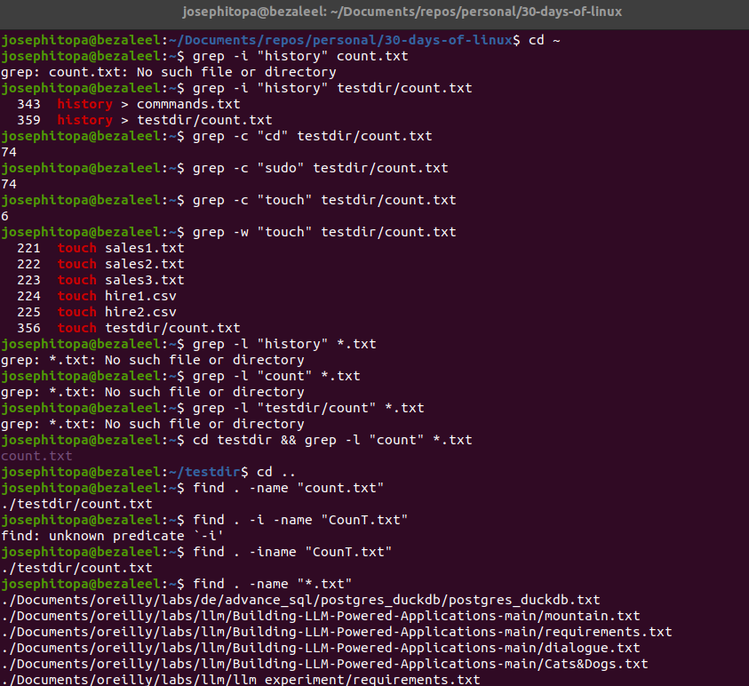

# Day 08 - [day-08: searching for files in linux]

## Objective
- To find files by name, and type.
- To search for words in a file.
---

## What I Learned
- I learn to search for files by name or type.
- I learnt to search and count a word within a file. 
- 

---

## What I Built / Practiced
- I practiced searching for files
- I practised searching for word in a file
- I practised searching for file using name irrespective of the sentence case of the name.
- 

---

## Challenges Faced
- None 

---

## Key Takeaways
- 'grep -i' - to search for files by name or type while ignoring case
- 'grep -c' - to count word appearance in a file.
- 'grep -w' - to search for a whole word in a file.
- 'find -name' - to search for specific file.
- 'find -iname' - to search for specific file ignoring case.

---

## Resources
- Linux Fundamentals by Paul Cobbaut.
- https://www.digitalocean.com/community/tutorials/grep-command-in-linux-unix
- https://www.redhat.com/en/blog/linux-find-command
- https://linuxize.com/post/how-to-find-files-in-linux-using-the-command-line/
- https://www.digitalocean.com/community/tutorials/how-to-use-find-and-locate-to-search-for-files-on-linux#introduction

---

## Output

(Include links, screenshots, code snippets, or results)

