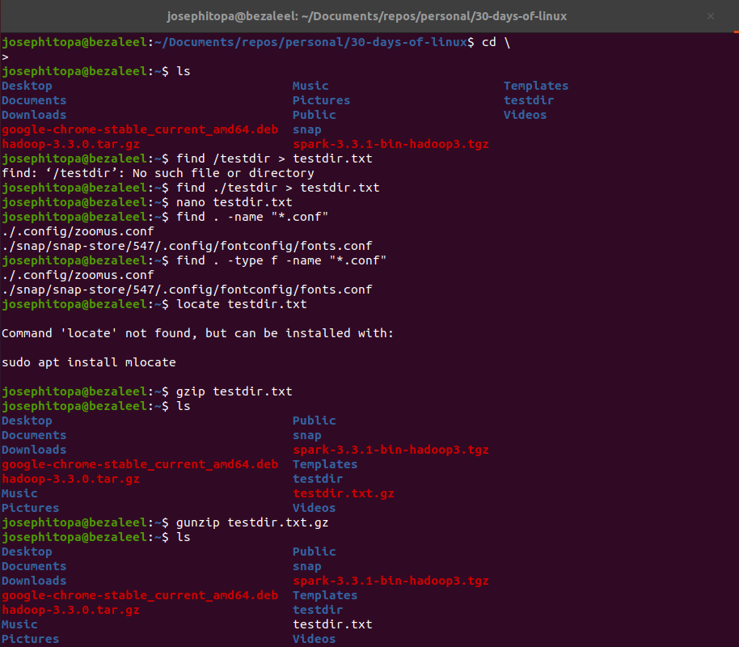
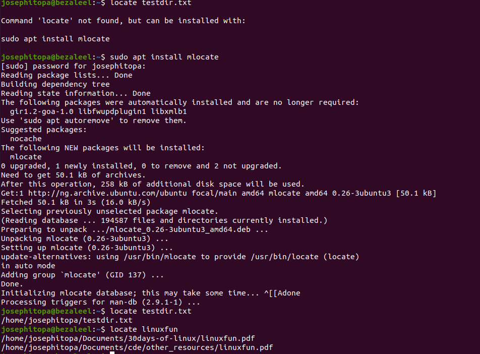

# Day 09 - [day-09: locating, compress, and uncompress file]

## Objective
- To locate and compress & uncompress file.

---

## What I Learned
- I learn to locate files irrespective of location on the computer
- I learn to compress and decompress file.

---

## What I Built / Practiced
- I practised locating file with 'locate' command.
- I practised to compress and decompress file with 'gzip'.

---

## Challenges Faced
- 'locate' is not a command on my linux. I had to install it using 'sudo apt install mlocate'.

---

## Key Takeaways
- 'locate' can find and display the directory of any file in the computer.
- 'gzip' can easily compress and decompress it.

---

## Resources
- Linux Fundamentals by Paul Cobbaut.

---

## Output

(Include links, screenshots, code snippets, or results)

