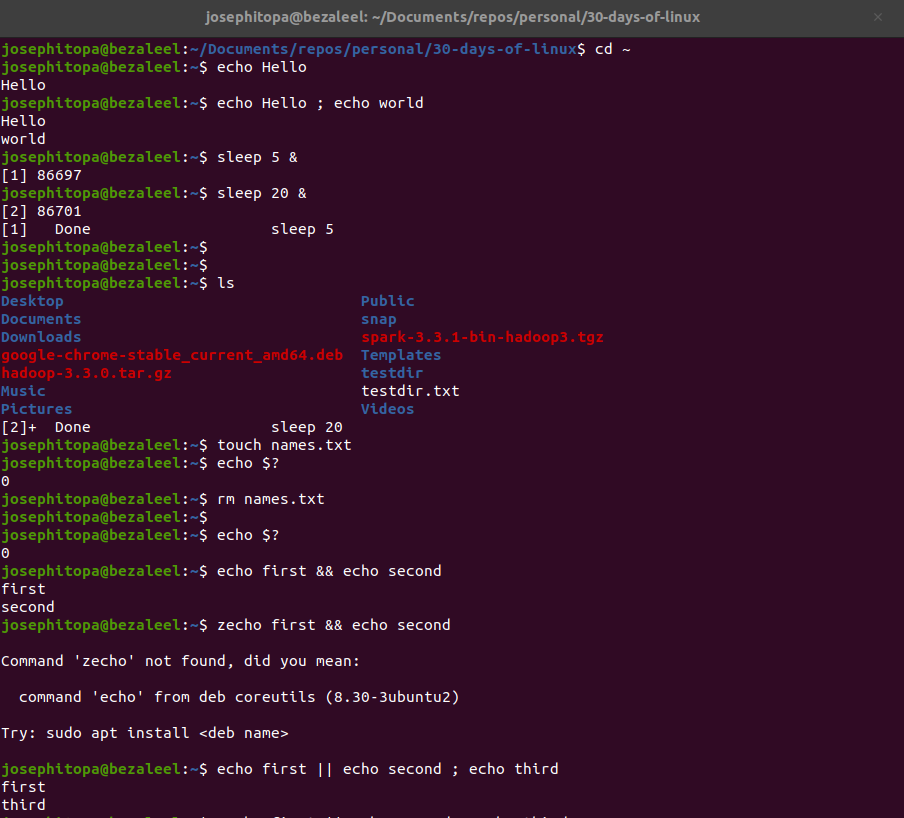
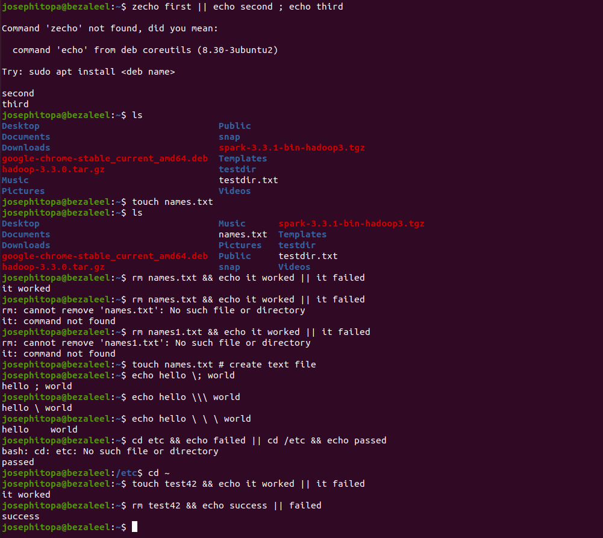

# Day 10 - [day-10: control operator in linux]

## Objective
- The objective is to learn about control operators in linux.

---

## What I Learned
- I learn to use operators, e.g. semi-colon, ampersand, double vertical bar, pound sign, escaping special character, etc.
- 

---

## What I Built / Practiced
- I practised logical OR and logical AND operators.
- I practised combining && (double ampersand) and || (double vertical bar)
- I practised using the pound sign for comment and the escaping special characters.

---

## Challenges Faced
- None

---

## Key Takeaways
- Understanding operators is not enough, combining them makes the operators more useful.
- "rm names.txt && echo it worked || it failed" - combines && and ||.
- "cd etc && echo failed || cd /etc && echo passed"
- "rm test42 && echo success || failed"
- "echo Hello ; echo world" - execute one commands after another.
- "echo first && echo second" - execute both commands.

---

## Resources
- Linux Fundamentals by Paul Cobbaut.

---

## Output

(Include links, screenshots, code snippets, or results)

