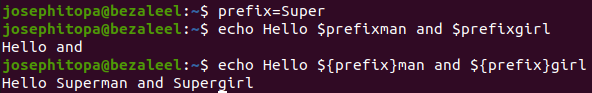
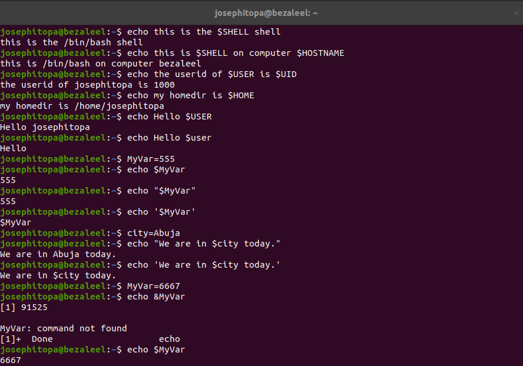
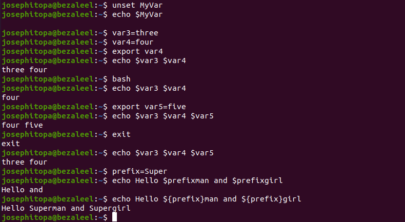

# Day 11 - [day 11 - shell variables]

## Objective
- To understnad shell variables on terminal and on bash.

---

## What I Learned
- I learn about creating variables.
- I learn about using the following: set & unset, dollar sign, 
- I learn about environment variable, and 'export'.
- I learn about delineate variables.

---

## What I Built / Practiced
- I practiced creating variables and using them.
- I practised delineate variables e.g. setting prefixes.
- I practised environment variables and how to export them.

---

## Challenges Faced
- None

---

## Key Takeaways
- 'unset' - can be used to remove the value of a variable.
- delineate variables aid in setting variables that can be used as prefixes.

---

## Resources
- Linux Fundamentals by Paul Cobbaut.

---

## Output

(Include links, screenshots, code snippets, or results)

