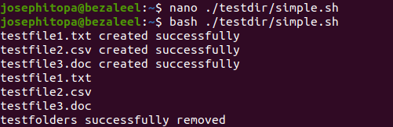
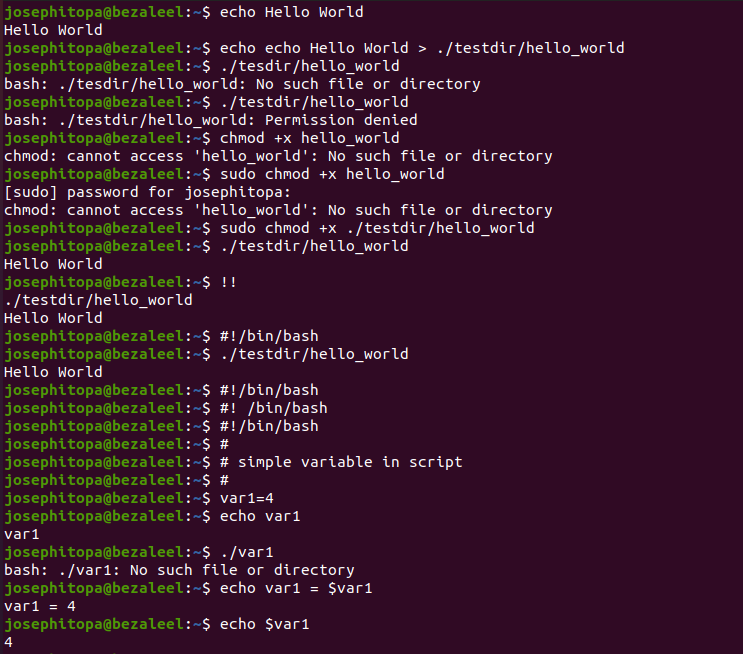
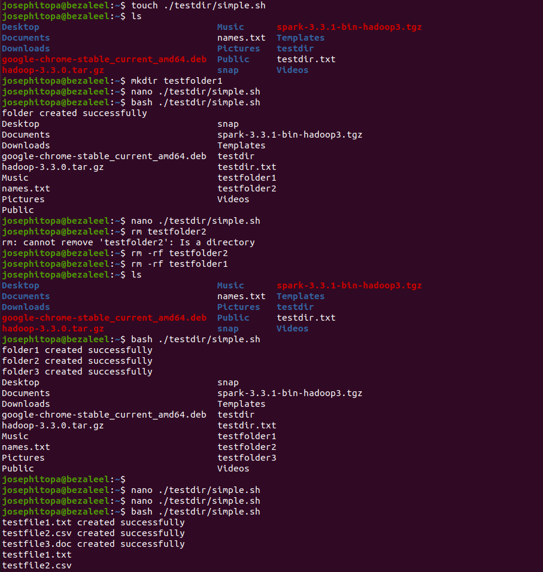

# Day 12 - [day 12: introduction to bash scripting]

## Objective
The objective is to: 
 - Writing .sh scripts
 - introducing comments (#!/bin/bash)
 - Running scripts

---
## What I Learned
To utilize bash script to do the following:
 - create directories
 - generate files
 - print outputs

---
## What I Built / Practiced
- I built a script to create multiple folders.
- I built a script to create files.
- I built a script to 

---
## Challenges Faced
- None

---
## Key Takeaways
- To run a script, use the 'bash' command and location of the script.
- Here is the script, simple.sh:
    - touch ./testfolder1/testfile1.txt
    - echo "testfile1.txt created successfully"
    - touch ./testfolder2/testfile2.csv
    - echo "testfile2.csv created successfully"
    - mkdir ./testfolder3/testfile3.doc
    - echo "testfile3.doc created successfully"
    - ls ./testfolder1
    - ls ./testfolder2
    - ls ./testfolder3
    - rm -rf ./testfolder1
    - rm -rf ./testfolder2
    - rm -rf ./testfolder3
    - echo "testfolders successfully removed"

---
## Resources
- Linux Fundamentals by Paul Cobbaut.

---
## Output

(Include links, screenshots, code snippets, or results)

