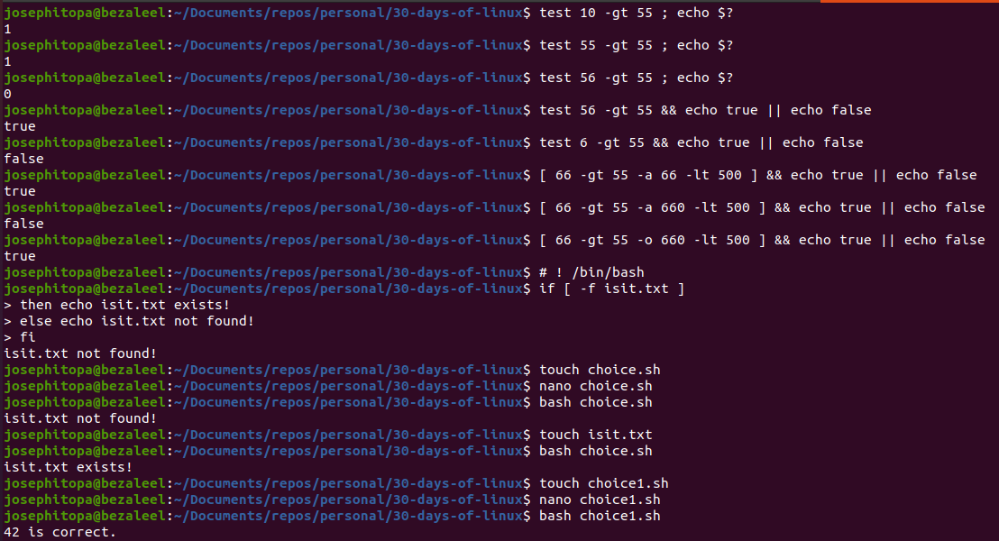
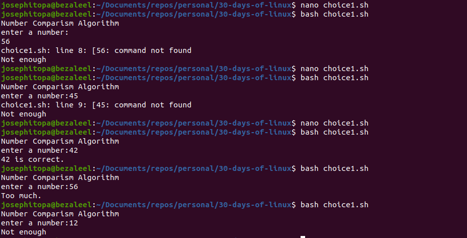

# Day 13 - [day 13: conditional logic in linux]

## Objective
- To learn and understand the conditional logics: if, else, elif, then

---
## What I Learned
- I learnt to compare numbers using the greater than ('-gt') and less than ('-lt').
- I learnt to use the logical AND and logical OR.
- I learnt to use the conditional logics(IF, ELSE, ELIF, THEN) in bash scripts.

---
## What I Built / Practiced
- I built a script to read input and compare with a standard value within the script.
- I built a static script to compare values using the logical conditions.

---
## Challenges Faced
- I faced a challenged reading value from the terminal. The error was from the control code, which should be bounded by double square.

---
## Key Takeaways
- conditional logics(IF, ELSE, ELIF, THEN) in bash scripts can make the script robust in terms of performance.
- The script performance can be improved by integrating logical conditions and logical operators(AND, OR) 

---
## Resources
- Linux Fundamentals by Paul Cobbaut.
- Introduction to Bash Scripting by Bobby Iliev.

---
## Output

(Include links, screenshots, code snippets, or results)

# ! /bin/bash
if [ -f isit.txt ]
then echo isit.txt exists!
else echo isit.txt not found!
fi

#!/bin/bash
echo "Number Comparism Algorithm"
read -p "enter a number:"  count

if [[ $count -eq 42 ]];
then
 echo "42 is correct."
elif [[ $count -gt 42 ]];
then
 echo "Too much."
else
 echo "Not enough"
fi
