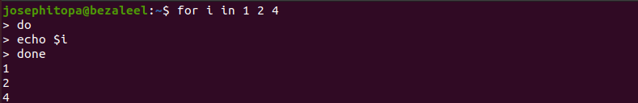
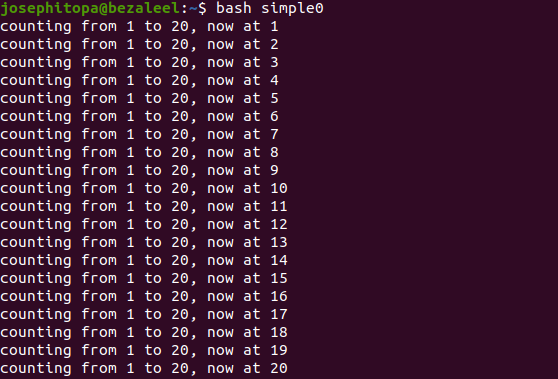
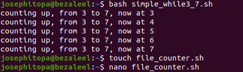
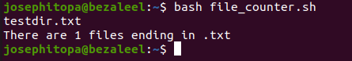

# Day 14 - [day 14: loops in linux]

## Objective
- To learn and understand the loops: for, while, and until.

---
## What I Learned
- I learnt to compare numbers using the greater than ('-gt') and less than ('-lt') under FOR loop.
- I learnt to use the followinf loops: FOR, WHILE, UNTIL.

---
## What I Built / Practiced
- I built a script to count numbers using the FOR, and the WHILE loop.
- I built a script to count files with particular extension(e.g. .txt).

---
## Challenges Faced
- Loop such as 'UNTIl' used carelessly can run infinitely.

---
## Key Takeaways
- The let built-in shell function instructs the shell to perform an evaluation of arithmetic
expressions.
- Loops are great for many use cases but must be used carefully.

---
## Resources
- Linux Fundamentals by Paul Cobbaut.

---
## Output
(Include links, screenshots, code snippets, or results)
#simple counter                                                                                                
#!/bin/bash
- for counter in  {1..20}
- do
-  echo counting from 1 to 20, now at $counter
-  sleep 1
- done

#counting with for loop
#!/bin/bash
- for counter in {3..7}
- do
-  echo counting from 3 to 7, now at $counter
- done

#counting with while loop
#!/bin/bash
- i=3
- while [ $i -le 7 ]
- do
-  echo counting up, from 3 to 7, now at $i
-  let i++
- done 

#file counter
#!/bin/bash
- let count=0
- for file in *.txt
- do
-  echo $file
-  let count++
- done
- echo "There are $count files ending in .txt"
