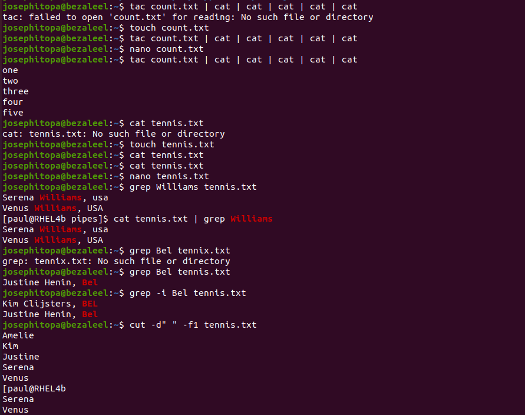
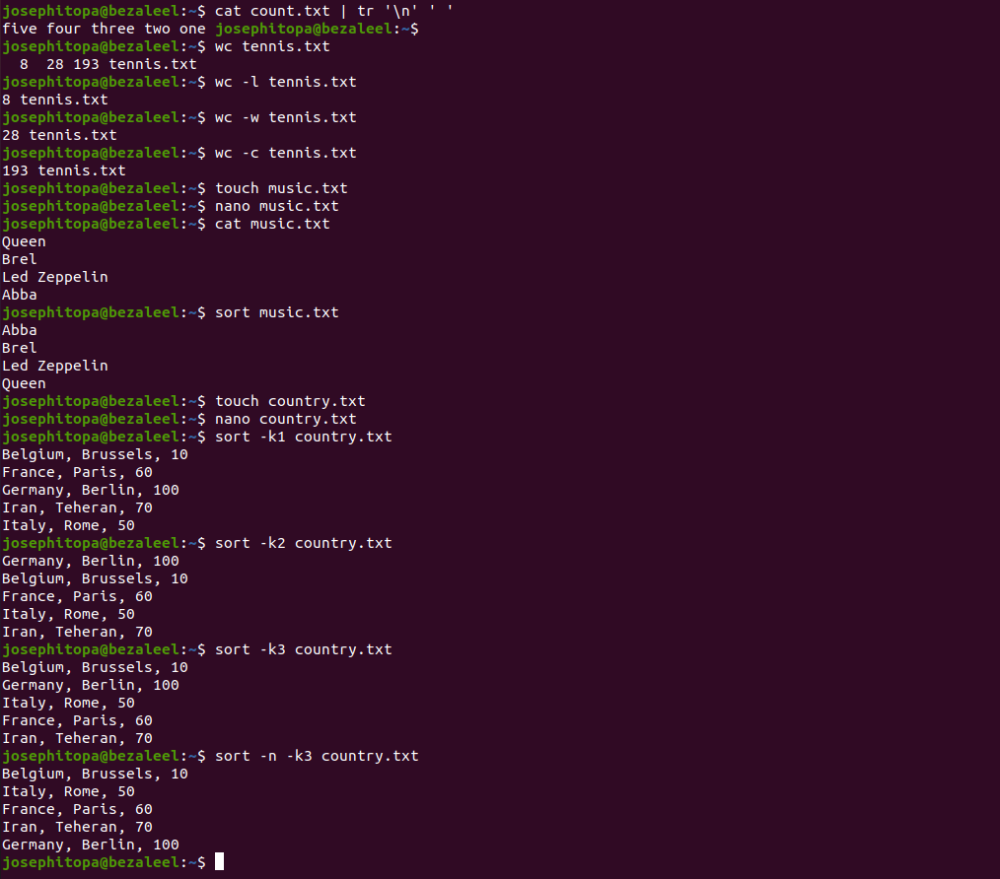

# Day 15 - [day-15: filters in linux]

## Objective
To under filtering in a linux environment.

---
## What I Learned
- I learnt 'sort', 'cut', 'tr', 'grep', etc. 

---

## What I Built / Practiced
- I practiced cutting text.
- I practiced sorting the content(text and numbers) of a file.
- I practiced filtering the needed text using grep.
- I practiced 'wc' to count the content of a file.

---
## Challenges Faced
- None 

---
## Key Takeaways
- we translate all newlines to spaces using ''.
- You can translate characters with 'tr'.
- The cut filter can select columns from files, depending on a delimiter or a count of bytes.
- grep is used to filter lines of text containing (or not containing) a certain string.
- Counting words, lines and characters is easy with wc.

---
## Resources
- Linux Fundamentals by Paul Cobbaut.

---
## Output
(Include links, screenshots, code snippets, or results)

