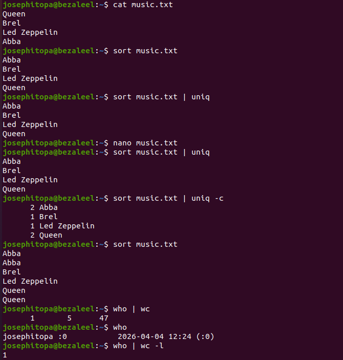

# Day 16 - [day-16: sorting and counting; automated file re-arrangment]
- To sort the content of files and move file of similar extension to a common folder.

---
## What I Learned
- I learnt to sort the content of a file and carry out unique count.
- I learnt to create a bash script for moving files with the same extension into a folder.

---
## What I Built / Practiced
- 'sort music.txt | uniq' : I practiced to uniquely sort the content of the folder.
- 'sort music.txt | uniq -c' : I practiced to uniquely sort and count the content of the folder.
- I built a bash script to move the files of similar extension into a folder.

---
## Challenges Faced
- None

---
## Key Takeaways
- unique values can be sorted.
- automated bash script for moving similar files to a folder.

---
## Resources
- Linux Fundamentals by Paul Cobbaut.

---
## Output
(Include links, screenshots, code snippets, or results)
- #!/bin/bash
- mkdir store_folder
- for file in *.txt; do
   - echo $file
   - mv $file store_folder
   - echo $file moved successfully.
- done

