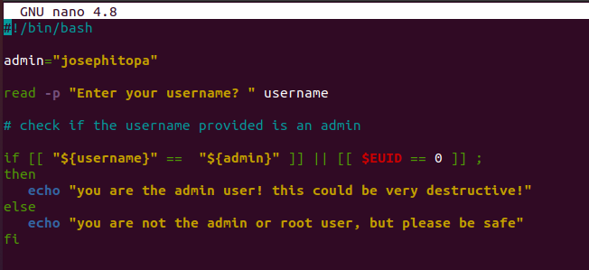
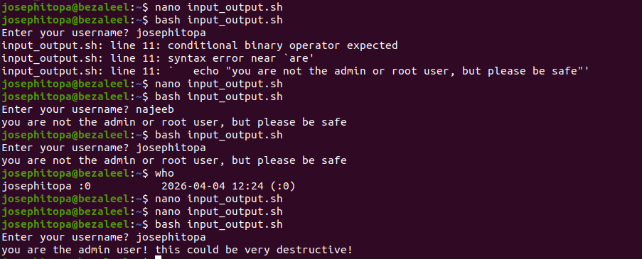

# Day 17 - [day-17: a bash script to verify an admin ]
## Objective
- To verify username and the admin status of the username.

---
## What I Learned
- I learn to write a bash script that takes username and verify if its an administrator.

---
## What I Built / Practiced
- I built a script for username verification for an administrator.

---
## Challenges Faced
- None

---
## Key Takeaways
- creating a bash script requires a clear objective to be fulfilled.

---
## Resources
- N/A

---
## Output
(Include links, screenshots, code snippets, or results)

