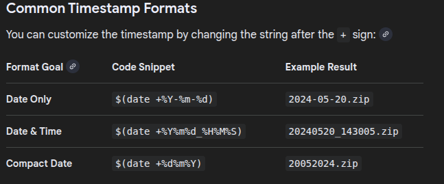
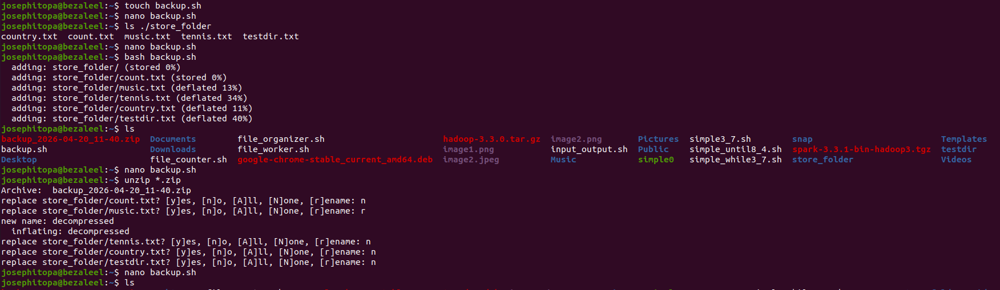
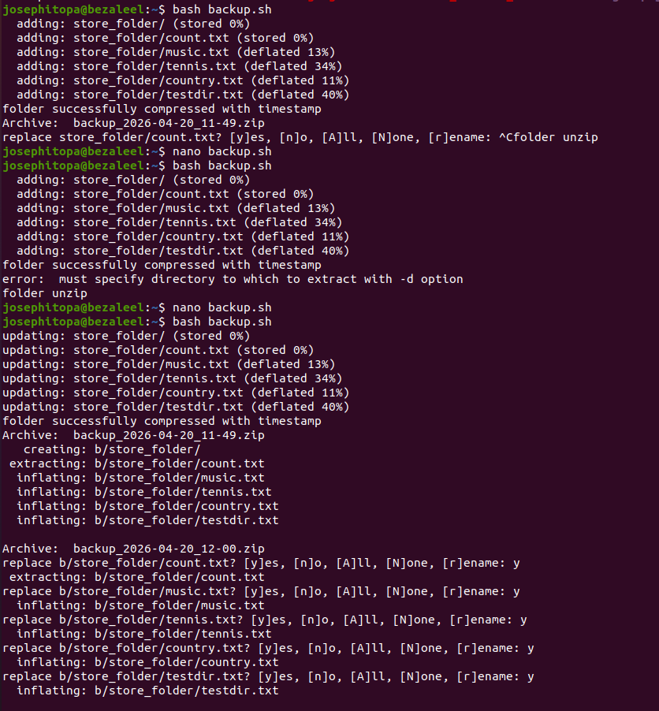
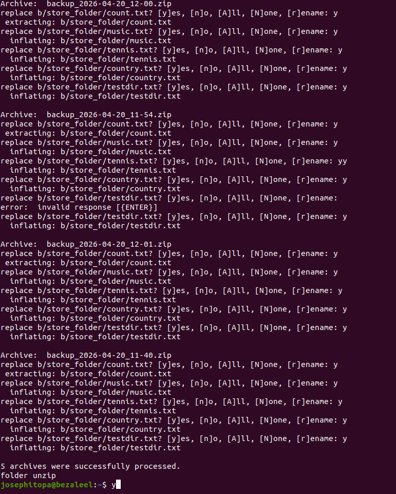

# Day 18 - [day-18: backup & restore Script]

## Objective
- Automate backups for important directories

---
## What I Learned
- Compress files (tar, gzip)
- Add timestamps
- Restore from backup

---
## What I Built / Practiced
- I built a bash script that compress and decompress folders.

---
## Challenges Faced
- None

---
## Key Takeaways
- '-r' flag is for recursive compression of folders and sub-folders.

---
## Resources
- https://share.google/aimode/meS0J4KTYPfur8Exp
- https://forums.linuxmint.com/viewtopic.php?t=436754

---
## Output
(Include links, screenshots, code snippets, or results)

