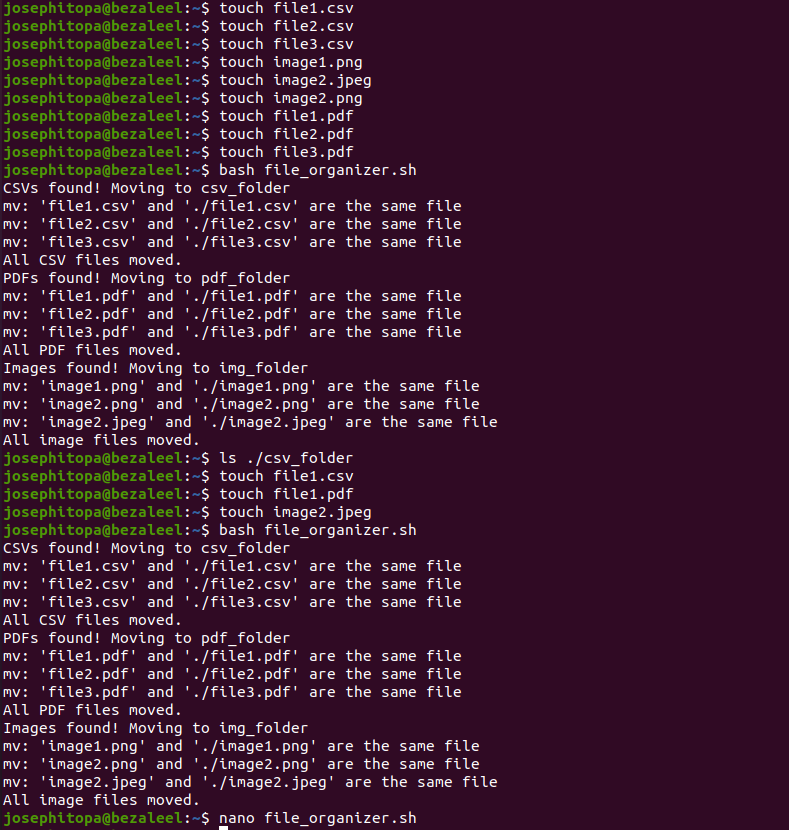

# Day 19 - [day-19: automatic file organizers]

## Objective
 - Clean and structure messy directories automatically.

---
## What I Learned
- Move files by extension (.jpg or png, .pdf, .csv)
- Create folders dynamically
- Handle duplicates

---
## What I Built / Practiced
- I built a script to automatically create folders.
- The script was also built to move files(csv, png, and jpeg) into their respective folders.

---
## Challenges Faced
- The script couldn't recognize the destination folders.
- The files are moved but are not found in the destination folders.

---
## Key Takeaways
- Don’t use elif when tasks are independent
- Avoid [ -f *.ext ] — use ls check or arrays

---
## Resources
- Google

---
## Output
(Include links, screenshots, code snippets, or results)
