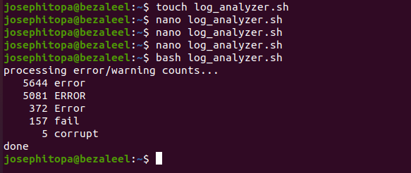

# Day 20 - [day-20: Log Analyzer & Reporter]

## Objective
- Extract insights from system/application logs

---
## What I Learned
- To parse .log files.
- To count errors, warnings, info logs.
- To generate a summary report.

---
## What I Built / Practiced
- I built a script to count and print all errors, and warning from the system log file.
- 

---
## Challenges Faced
- Its diffeicult to sort log by timestamp after sorting and grouping by error type.

---
## Key Takeaways
- grep -o is great for pattern counting
- Always think: “what structure am I grouping by?”

---
## Resources
- https://askubuntu.com/questions/804918/how-to-filter-out-errors-in-ubunty-system-log-files
- https://dev.to/cuongnp/5-log-parsing-commands-3oc1 

---
## Output
(Include links, screenshots, code snippets, or results)

