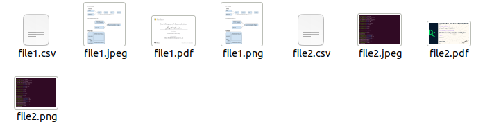
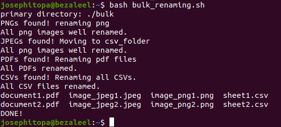

# Day 21 - [day-21: Bulk File Renaming Tool]

## Objective
- Standardize file naming conventions

---
## What I Learned
- To Rename files using patterns.
- To Add prefixes/suffixes.
- To Replace spaces, change case.

---
## What I Built / Practiced
- I built a script to read user's input which is a directory and rename the files in that directory.

---
## Challenges Faced
- A bug which make the script to fail.

---
## Key Takeaways
- the script can read the directory and carry out the necessary operations.
- 

---
## Resources
- https://askubuntu.com/questions/894078/how-to-read-and-echo-whatever-the-user-typed
- Linux Fundamentals by Paul Cobbaut.

---
## Output
(Include links, screenshots, code snippets, or results)

