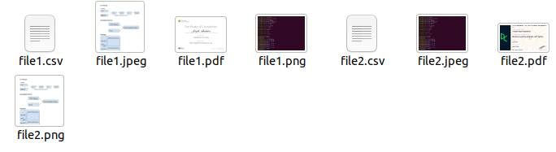
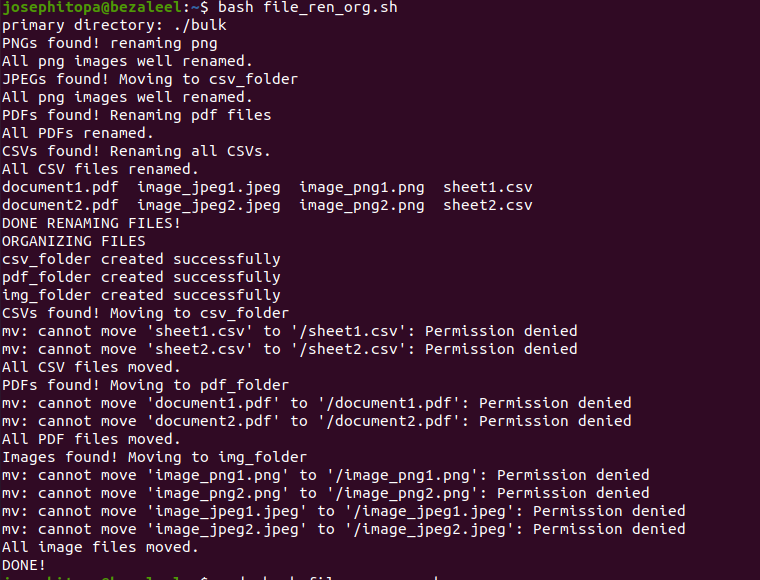
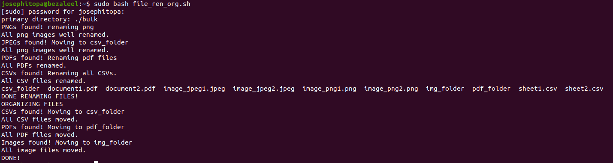
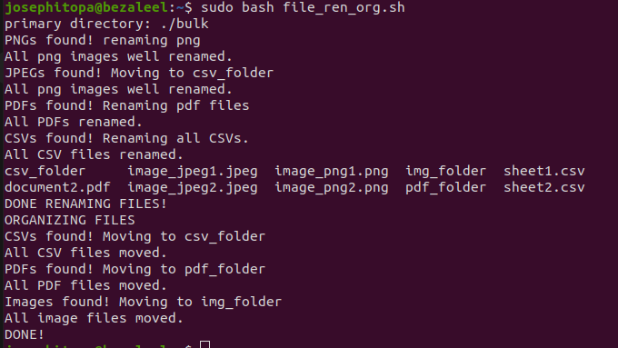

# Day 22 - [day-22: Bulk renaming of files and organizing]

## Objective
-  To build a script that automatically rename files and organized them into their respective folders.

---
## What I Learned
- Combining what I learnt from organizing files, with what I learnt from bulk file renaming

---
## What I Built / Practiced
- I built a single script that can rename bulk files, and organize them into their respective directory.
- 

---
## Challenges Faced
- I had an issue moving the files to their respective folders due to permission. The remedy was to apply 'sudo'.

---
## Key Takeaways
- Writing scripts is one part, understanding how to make the script solve real world problem is another. This project has open my eyes to that.
- 

---
## Resources
- Linux Fundamentals by Paul Cobbaut.

---
## Output
(Include links, screenshots, code snippets, or results)

