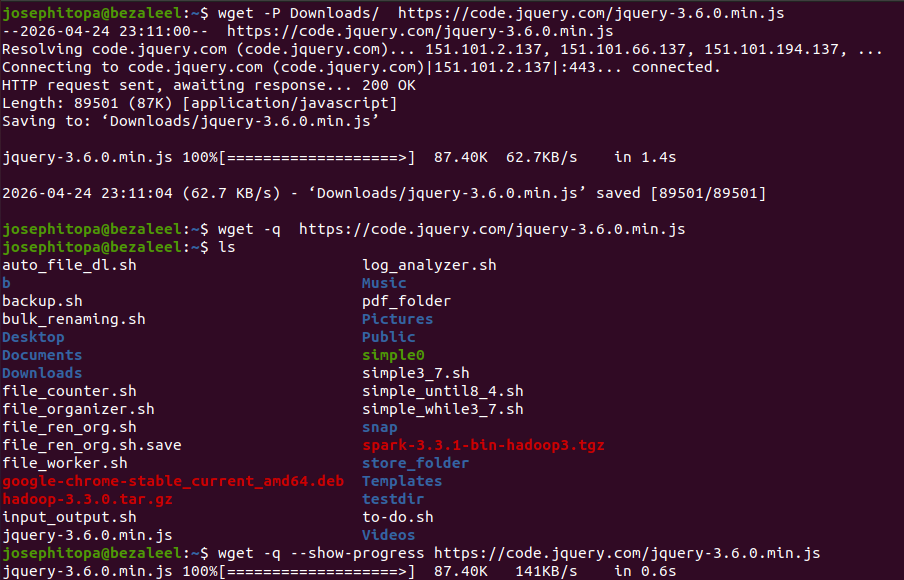
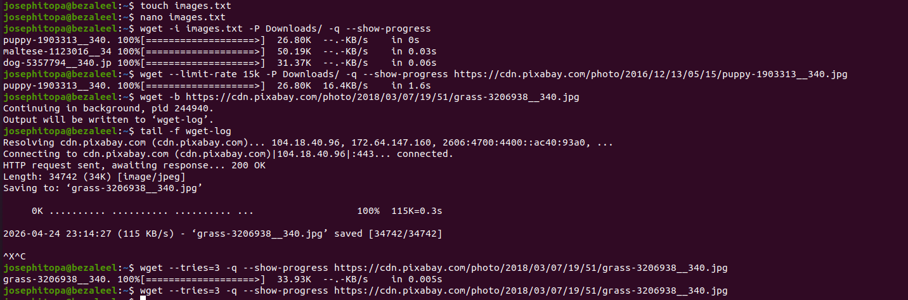

# Day 23 - [day-23: how to use wget to download files]

## Objective
- Using wget to download files on linux terminal.

---
## What I Learned
- how to download multiple files.
- how to download files to a specific directory.
- how to download files in the background.

---
## What I Built / Practiced
- I practiced downloading files from multiple urls.
- I practiced downloading files while showing progress bar.
- I practiced downloading files in the background while the progress can be viewed from wget log.
- I practiced downloading files to a specific directory.

---
## Challenges Faced
- None

---
## Key Takeaways
- wget allows for multipe download of files if all the url is stored in a text file.
- wget has provision for limiting the rate(download speed) at which a file is download.

---
## Resources
- https://www.digitalocean.com/community/tutorials/how-to-use-wget-to-download-files-and-interact-with-rest-apis

---
## Output
(Include links, screenshots, code snippets, or results)

