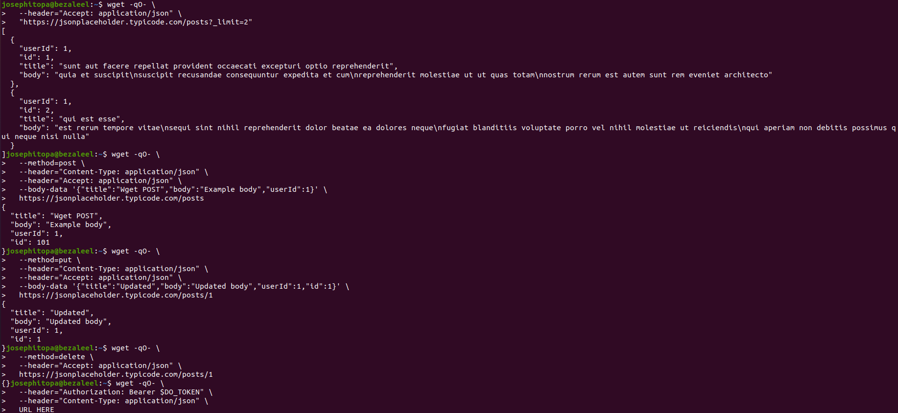
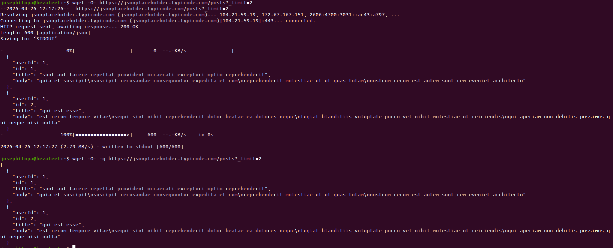

# Day 24 - [day-24: Interacting with REST API using wget]

## Objective
- To use Wget to interact with REST APIs without having to install an external program.

---
## What I Learned
- I learned the syntax to send the most commonly used HTTP methods: GET, POST, PUT, and DELETE.

---
## What I Built / Practiced
- I used the POST method to send request.
- I used the GET method to query records.
- I used the PUT method to adjust records.
- I used the DELETE method to remove records.

---
## Challenges Faced
- I installed jq but its not formatting the API request.

---
## Key Takeaways
- WGET makes it easy to interact with the REST API because one can use all the REST API methods while engaging WGET via the terminal.

---
## Resources
- https://www.digitalocean.com/community/tutorials/how-to-use-wget-to-download-files-and-interact-with-rest-apis

---
## Output
(Include links, screenshots, code snippets, or results)

