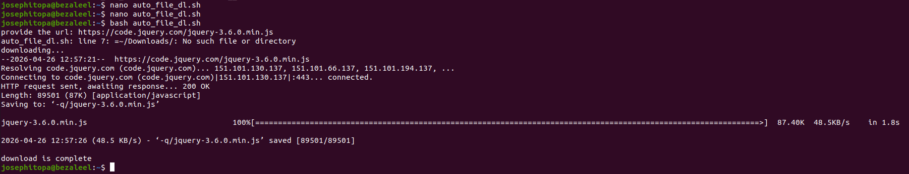

# Day 25 - [day-25: automatic file donwloader]

## Objective
- To build a script that accepts url as input and then download the file to a specified folder.

---
## What I Learned
- I learn to automatically download file.

---
## What I Built / Practiced
- I built a bash script that can download file from the internet, to a specified folder.

---
## Challenges Faced
- None

---
## Key Takeaways
- The knowledge of reading input from the terminal and WGET for interacting with the internet can be combined to build an automatic file downloader.

---
## Resources
- Lessons drawn from day 21 & 23 

---
## Output
(Include links, screenshots, code snippets, or results)

