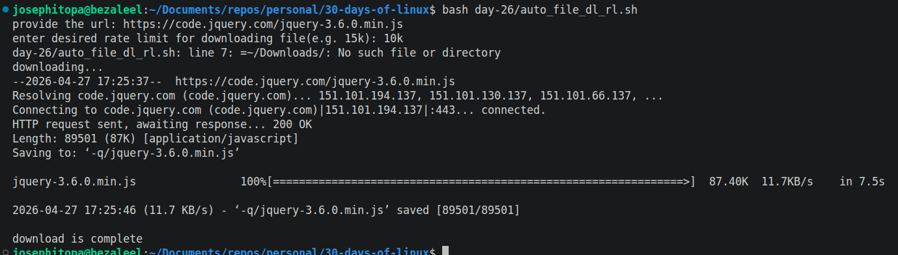

# Day 26 - [day-26: automatic file downloader with adaptable rate limiting]

## Objective
- To add an adaptable rate limit to the bash script 

---
## What I Learned
- I learn to make an automatic file downloading script to be adaptable to speed.
- 

---
## What I Built / Practiced
- I built a file downloading bash script that can take inputs such as link, and the rate limit.

---
## Challenges Faced
- None

---
## Key Takeaways
- Rate limit helps to either reduce or increase the speed of the file download.

---
## Resources
- https://www.digitalocean.com/community/tutorials/how-to-use-wget-to-download-files-and-interact-with-rest-apis#interacting-with-rest-apis

---
## Output
(Include links, screenshots, code snippets, or results)
