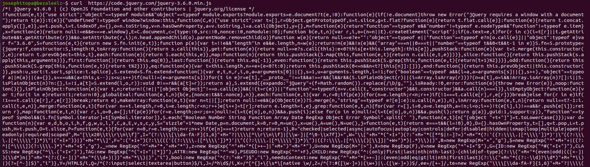
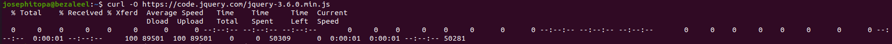

# Day 27 - [day-27: downloading files using curl command]

## Objective
- To practise using cURL to download file

---
## What I Learned
- I learnt that cURL unlike wget, prints the content of the file it downloads.
- I learnt that to download the file with printing it content, a flag '-O' must be introduced.

---
## What I Built / Practiced
- I practiced the cURL command, with and without the '-O' flag

---
## Challenges Faced
- None

---
## Key Takeaways
- 'curl' without any flag tends to download and display the content of the file.
- To save the downloaded file, it must be with '-O' flag.

---
## Resources
- https://www.digitalocean.com/community/tutorials/workflow-downloading-files-curl#step-6-automating-downloads-with-shell-scripts

---
## Output
(Include links, screenshots, code snippets, or results)

