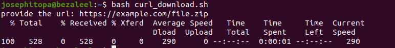
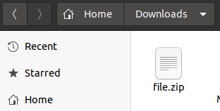

# Day 28 - [day-28: Automating downloads with shell scripts]

## Objective
- To build a script that takes a url as input, and use cURL to download the file to the Download folder.

---
## What I Learned
- I learnt to built an automated script that takes URL as input and download the file to a default folder(Downloads). 

---
## What I Built / Practiced
- I built a bash script centered around cURL for downloading files.
- 

---
## Challenges Faced
- None

---
## Key Takeaways
- Automating downloads can be useful in CI/CD pipelines or regular backups. This is especially relevant when working with REST APIs that require regular data updates.
- The -O (uppercase “o”) option in curl saves the downloaded file using the original filename as provided by the server in the URL or HTTP headers. On the other hand, the -o (lowercase “o”) option allows you to specify a custom filename for the downloaded file.

---
## Resources
- https://www.digitalocean.com/community/tutorials/workflow-downloading-files-curl#step-6-automating-downloads-with-shell-scripts

---
## Output
(Include links, screenshots, code snippets, or results)

