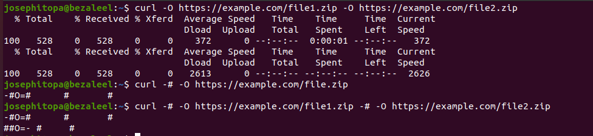

# Day 29 - [day-29: downloading multiple files and monitoring using curl command]

## Objective
- To download multiple files while monitoring the progress using cURL

---
## What I Learned
- I learnt to download multiple files by repeating the cURL command on the same line.
- I learnt to monitor the progress of file(s) download using '-#'

---
## What I Built / Practiced
- I practised this downloading multiple files, and monitoring the downloads on the terminal.

---
## Challenges Faced
- None

---
## Key Takeaways
- To download multiple files using cURL, simply repeat the command for downloading a single file.
- To monitor download progress, the flag '-#' is used. 

---
## Resources
- https://www.digitalocean.com/community/tutorials/workflow-downloading-files-curl#step-6-automating-downloads-with-shell-scripts

---
## Output
(Include links, screenshots, code snippets, or results)
