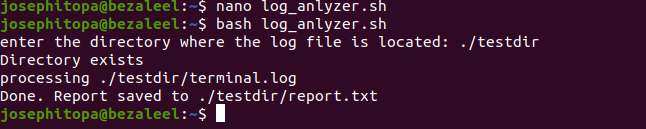
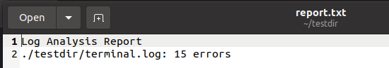

# Day 30 - [day-30: Log analyzer & file organizer]

## Objective
- To Build a Bash script that:
    1.​ Accepts a directory as input.
    2.​ Scans all .log files.
    3.​ Extracts: Error lines (grep), Counts occurrences (wc);
    4.​ Outputs summary report.
    5.​ Moves processed logs into '/processed_logs'
    6.​ Saves results into a report file.

---
## What I Learned
- I learn to analyze a folder that has several log files and to generate a summary report. 
- 

---
## What I Built / Practiced
- I built a log analyzer that can also organize files.
- 

---
## Challenges Faced
- I missed a double qoute that led to series of errors.
- When I didn't introduce a directory check, it also led to lots of errors.

---
## Key Takeaways
- Error and warning reports can be summarized for a weekly or monthly update in a meeting.
- 

---
## Resources
- https://stackoverflow.com/questions/59838/how-do-i-check-if-a-directory-exists-or-not-in-a-bash-shell-script

---
## Output
(Include links, screenshots, code snippets, or results)

